# 🚀 Samba4 Enterprise Identity Suite

> Enterprise-grade Samba4 Active Directory infrastructure automated with Ansible, Linux hardening, monitoring, and Infrastructure as Code.


---

## 📌 Overview

This project automates the deployment of a production-style centralized Identity & Access Management (IAM) environment using Samba4 Active Directory Domain Services on Linux.

The infrastructure is designed as an open-source alternative to traditional Windows Active Directory environments for:

- Educational Labs
- Offices & SMEs
- Linux-based infrastructure environments
- Training centers
- DevOps learning labs

Using Infrastructure as Code (IaC) principles, the platform provisions:

- Samba4 Active Directory Domain Controller
- Linux client integration
- Automated domain joining
- Infrastructure hardening
- Monitoring & administration tools
- Shared storage environments

---

## ⚙️ Technology Stack

| Technology | Purpose |
|---|---|
| Samba4 | Active Directory Domain Controller |
| Ansible | Automation & Configuration Management |
| Debian 12 | Linux Server Operating System |
| Vagrant | Infrastructure Virtualization |
| VirtualBox | Local Infrastructure Lab |
| Cockpit | Monitoring & Web Administration |
| SSSD / Realmd | Linux Domain Authentication |
| Bash | Automation & Scripting |

---

## 🏗️ Enterprise Architecture

### Infrastructure Components

| Component | Purpose |
|---|---|
| DC1 | Samba4 Active Directory Domain Controller |
| Linux Clients | Domain Joined Workstations |
| DNS & Kerberos | Centralized Authentication |
| Ansible Control Node | Infrastructure Automation |
| Cockpit | Monitoring & Management |

---

## 🌐 Infrastructure Flow

```text
Host Machine (Xubuntu)
        │
        ├── Ansible Control Node
        │
        ├── Vagrant Infrastructure
        │
        ├── Samba4 Domain Controller
        │
        ├── Linux Domain Clients
        │
        └── Monitoring & Administration
```

---

## 📂 Project Structure

```text
samba4-enterprise-identity-suite/
├── ansible/
│   ├── inventories/
│   │   └── lab/
│   │       ├── hosts.ini
│   │       └── students.txt
│   ├── playbooks/
│   │   ├── backup_ad.yml
│   │   ├── deploy_students.yml
│   │   ├── join_and_secure.yml
│   │   ├── join_linux_client.yml
│   │   ├── prepare_dc.yml
│   │   ├── provision_dc.yml
│   │   ├── setup_dns_forwarding.yml
│   │   ├── setup_home_folders.yml
│   │   ├── setup_monitoring.yml
│   │   └── setup_shares.yml
│   ├── roles/
│   │   ├── backup/
│   │   ├── linux_client/
│   │   ├── monitoring/
│   │   ├── samba_dc/
│   │   └── security/
│   └── site.yml
├── backups/
├── docs/
│   ├── architecture/
│   ├── screenshots/
│   └── troubleshooting/
├── monitoring/
├── terraform/
├── scripts/
├── README.md
├── Vagrantfile
└── ssh_config
```

---

## 🚀 Core Features

| Feature | Description |
|---|---|
| ⚡ Infrastructure Automation | Automated deployment using Ansible |
| 🔐 Centralized Authentication | Samba4 Active Directory Domain |
| 🖥️ Linux Domain Join | Automated Linux client integration |
| 📁 Shared Storage | Centralized SMB shares |
| 🛡️ Security Hardening | SSH hardening, firewall, secure authentication |
| 📊 Monitoring | Cockpit monitoring dashboard |
| 🔄 Idempotent Playbooks | Safe repeatable deployments |
| 🧠 Infrastructure as Code | Reproducible environments |

---

## 🧩 Main Playbooks

| Playbook | Purpose |
|---|---|
| provision_dc.yml | Deploy Samba4 Domain Controller |
| prepare_dc.yml | Prepare DC prerequisites |
| join_and_secure.yml | Join Linux clients to domain & apply security hardening |
| join_linux_client.yml | Join individual Linux clients to AD domain |
| setup_monitoring.yml | Deploy Cockpit monitoring |
| setup_shares.yml | Configure shared folders |
| setup_home_folders.yml | Configure user home directories |
| setup_dns_forwarding.yml | Configure DNS forwarding |
| deploy_students.yml | Bulk deploy student accounts |
| backup_ad.yml | Backup Active Directory environment |

---

## 🚀 Quick Start

### 1. Clone Repository

```bash
git clone https://github.com/muhammadkamrankabeer-oss/samba4-enterprise-identity-suite.git
cd samba4-enterprise-identity-suite
```

### 2. Start Infrastructure

```bash
vagrant up
```

### 3. Run Infrastructure Automation

```bash
ansible-playbook -i ansible/inventories/lab/hosts.ini ansible/playbooks/provision_dc.yml

ansible-playbook -i ansible/inventories/lab/hosts.ini ansible/playbooks/join_and_secure.yml
```

---

## 📸 Deployment Screenshots

### Vagrant Infrastructure

**Vagrant Up — VM provisioning**

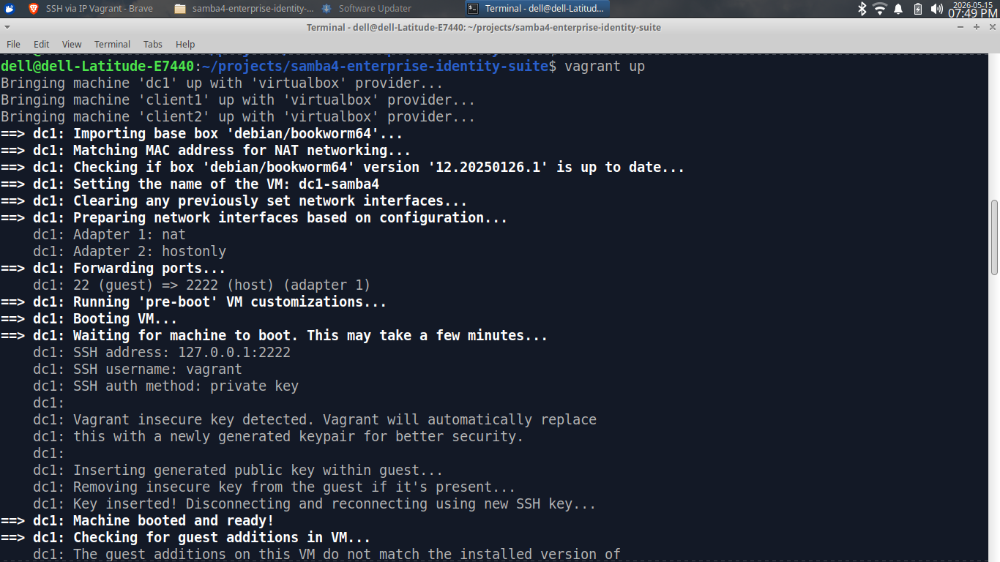

**Vagrant Status — Infrastructure running**

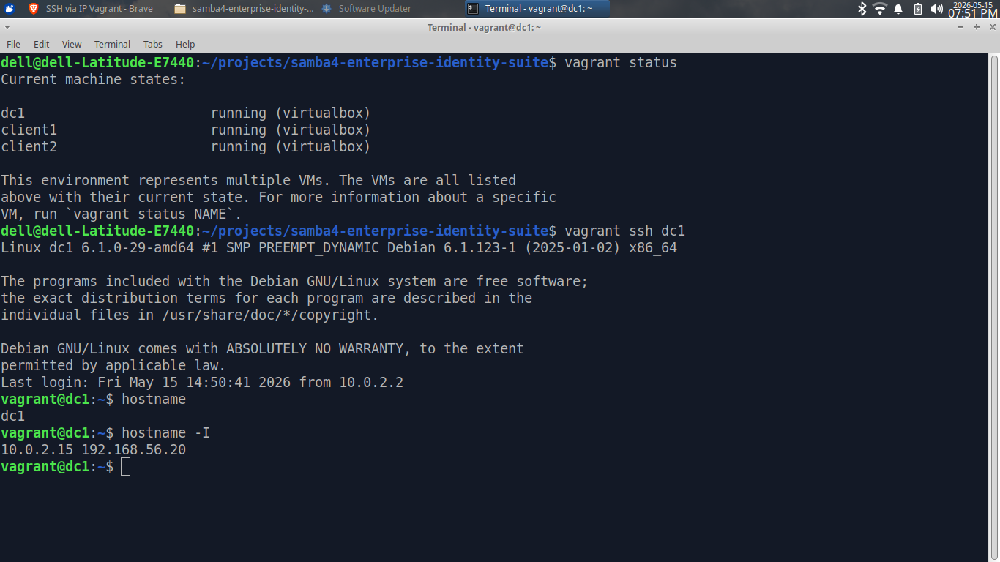

---

### Ansible Automation

**Ansible Ping — Connectivity verified across all hosts**

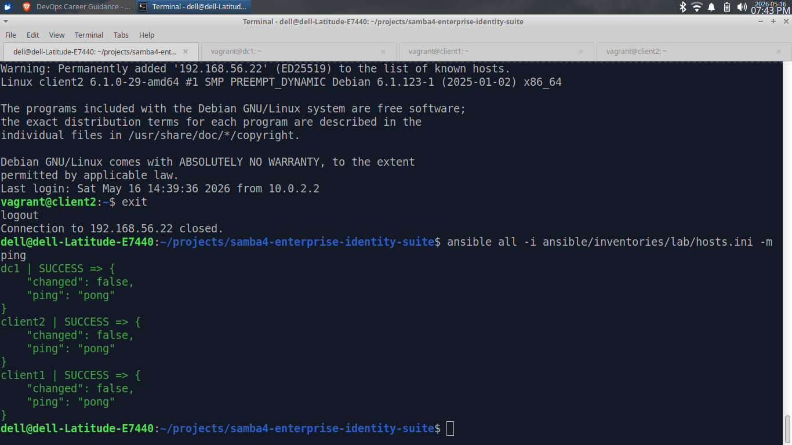

**Provision DC — Samba4 Domain Controller deployed successfully**

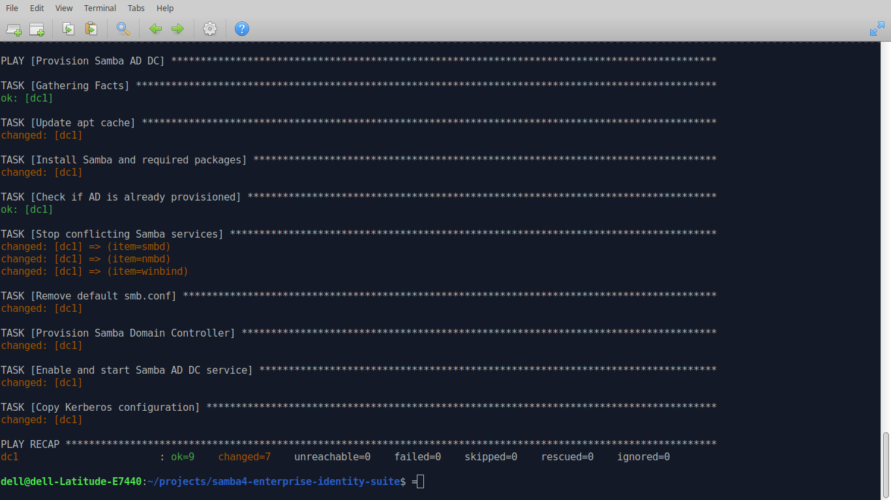

**Idempotent Playbook — Safe re-run with no unintended changes**

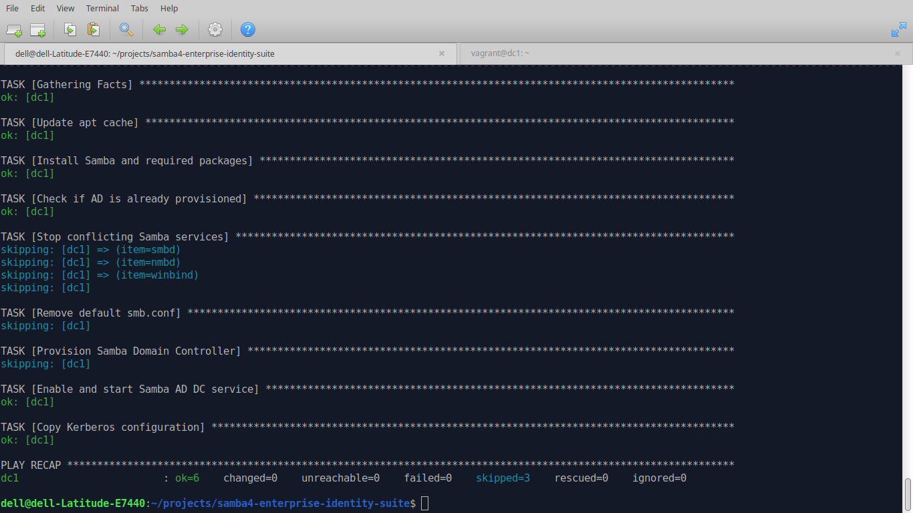

---

### Domain Controller & Services

**Samba Service Running**

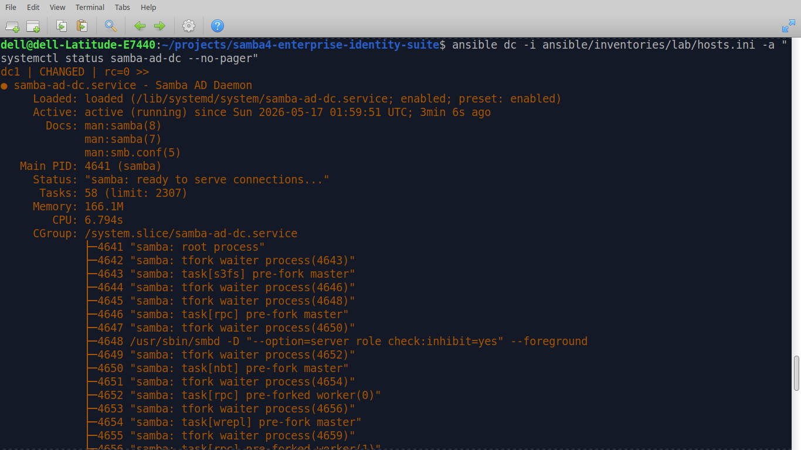

**SSSD Service Running**

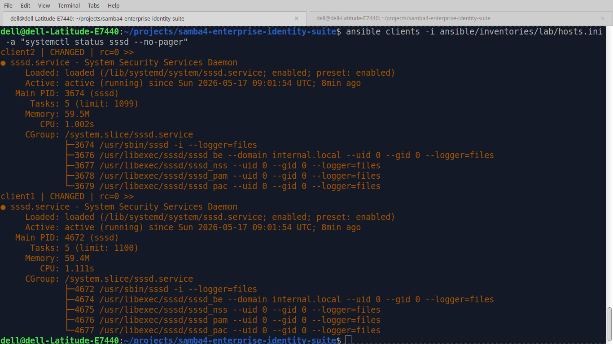

**Domain Level Check**

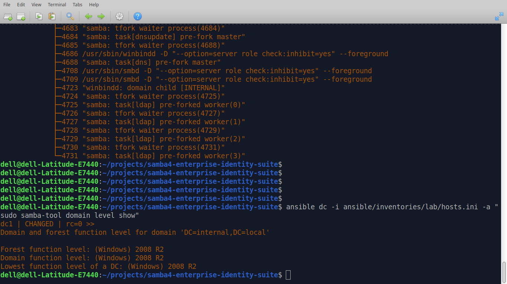

---

### Domain Join & Authentication

**Linux Domain Join — Client successfully joined to AD**

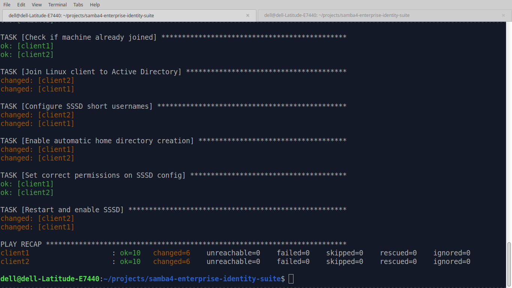

**Domain Joining Process**


**Domain Login — Successful AD user login on Linux client**

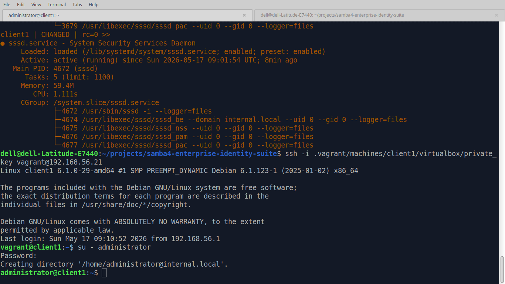

**Domain User Authentication**

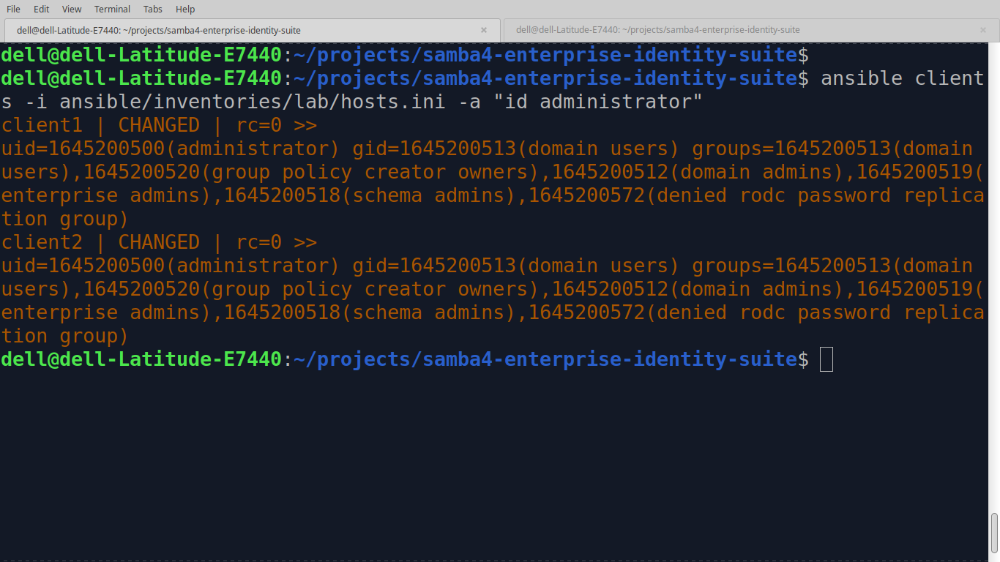

---

### Domain Verification

**Domain Info, User List & Kerberos Ticket (klist)**

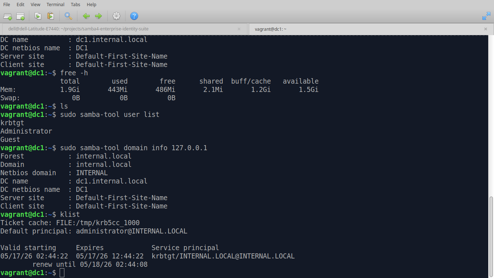

---

### Monitoring

**Cockpit Enterprise Dashboard**

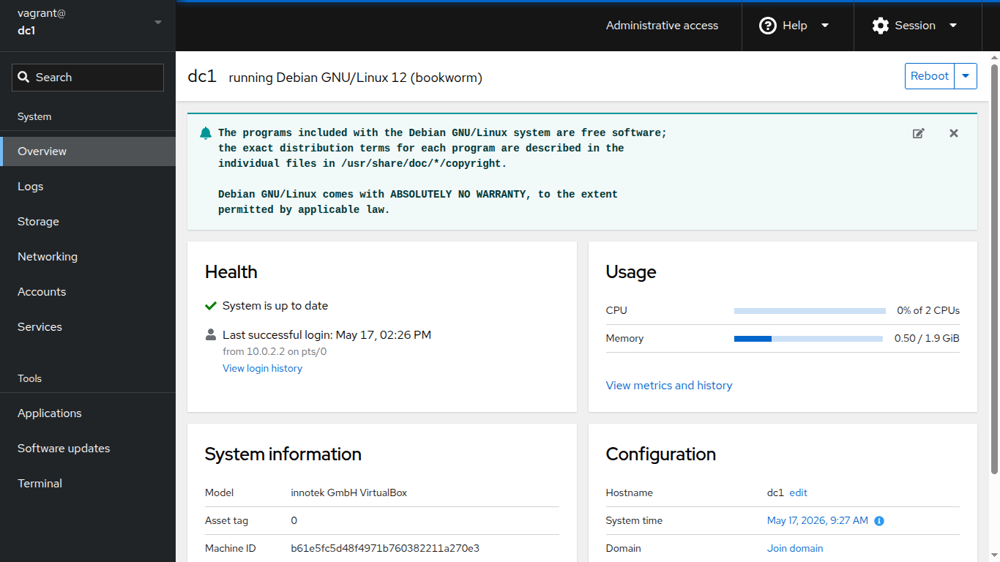

**Cockpit Playbook Execution**

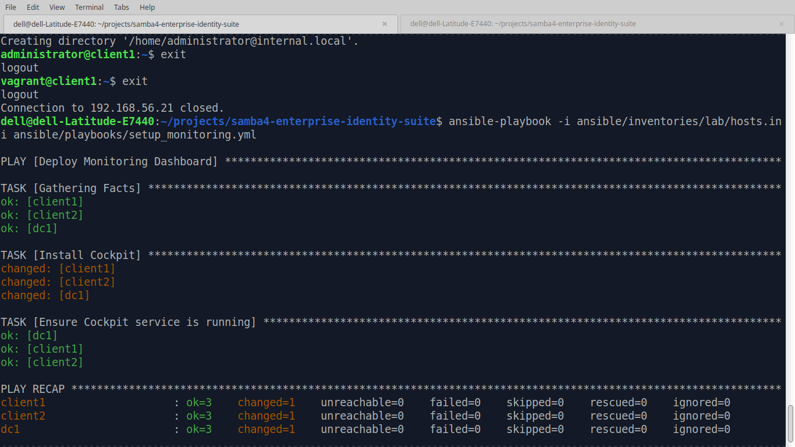

---

## 🔍 Validation Commands

### Verify Kerberos Authentication

```bash
kinit administrator
klist
```

### Verify Domain Membership

```bash
realm list
```

### List Samba Users

```bash
sudo samba-tool user list
```

### Check Samba Service Status

```bash
systemctl status samba-ad-dc
```

### Check SSSD Service Status

```bash
systemctl status sssd
```

---

## 🔐 Security Features

- SSH hardening
- Linux firewall configuration
- Kerberos-secured authentication
- Centralized user access control
- Infrastructure isolation using Vagrant
- Security role applied via Ansible (`roles/security`)

---

## 🏢 Enterprise Use Cases

This platform can be adapted for:

- Educational Labs & Campuses
- Small & Medium Businesses (SMEs)
- Linux-based Office Infrastructure
- Open-source Active Directory Environments
- Centralized Authentication Systems
- Hybrid Linux Infrastructure Labs
- IT Training Environments
- Automated Infrastructure Demonstrations

---

## 🧠 Skills Demonstrated

- Linux System Administration
- Infrastructure Automation
- Configuration Management
- Identity & Access Management (IAM)
- Infrastructure as Code (IaC)
- Ansible Automation & Role Design
- Enterprise Networking
- DNS & Kerberos
- Monitoring & Observability
- Virtualization
- Security Hardening
- Troubleshooting & Operations

---

## 🧠 Future Improvements

- [ ] Automated daily backups
- [ ] Prometheus + Grafana monitoring
- [ ] Terraform-based cloud deployment
- [ ] Role-based access control
- [ ] CI/CD pipeline validation
- [ ] Automated infrastructure testing
- [ ] Multi-site Samba replication
- [ ] AWS deployment architecture

---

## 👨‍💻 Author

### Muhammad Kamran Kabeer

DevOps Engineer focused on Linux infrastructure, automation, cloud engineering, and Infrastructure as Code.

🌐 Website: [https://www.devriston.com.pk](https://www.devriston.com.pk)

💼 LinkedIn: [https://www.linkedin.com/in/kamrankabeer/](https://www.linkedin.com/in/kamrankabeer/)

🐙 GitHub: [https://github.com/muhammadkamrankabeer-oss](https://github.com/muhammadkamrankabeer-oss)

---

## ⭐ Support

If you found this project useful, consider giving it a star ⭐

This helps others discover the project and supports open-source learning.
