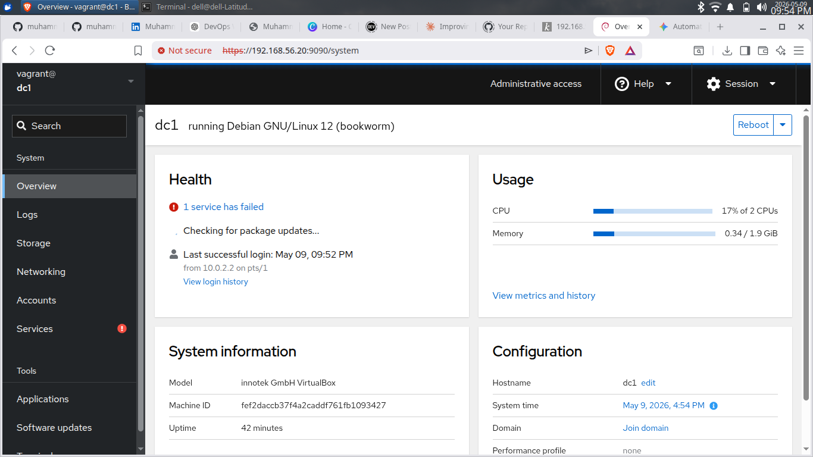
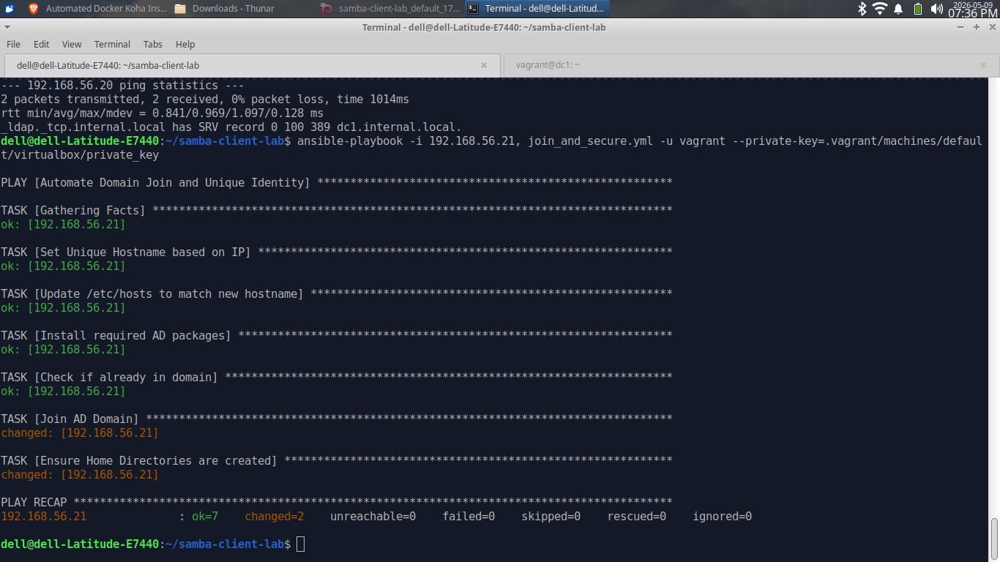

# 🚀 Samba4 Automated Enterprise Identity Suite

> Automated deployment of a production-grade **Samba4 Active Directory Domain Controller** and Hardened Linux Clients using **Ansible** and **Vagrant**.


---

## 📌 Overview

This project automates the provisioning of a centralized **Identity & Access Management (IAM)** solution.

The core infrastructure is built on a **Samba4 Active Directory Domain Controller (AD-DC)**. The environment is designed to replace expensive proprietary directory services with a robust, open-source alternative that handles DNS, Kerberos authentication, and LDAP.

Using a modular **Infrastructure-as-Code (IaC)** approach, this suite automates:

- **Server Provisioning:** Full Samba4 AD-DC promotion and DNS configuration
- **Client Integration:** Secure, zero-touch domain joining for Linux workstations
- **User Management:** Automated creation of domain users and departmental file shares

---

## ⚙️ Tech Stack

| Tool | Role |
|------|------|
| **Samba 4** | Active Directory Domain Controller |
| **Ansible** | Automation & Orchestration |
| **Debian 12** | Operating System |
| **Vagrant / VirtualBox** | Infrastructure Virtualization |
| **Cockpit** | Real-time System Monitoring |
| **SSSD & Realmd** | Secure Linux Domain Integration |

---

## 🏗️ Architecture

### Domain Controller (DC1)

| Setting | Value |
|---------|-------|
| Internal IP | `192.168.56.20` |
| Domain | `internal.local` |
| Services | BIND9 DLZ (DNS), Kerberos KDC, LDAP |

### Member Workstations (PC-XX)

- **Auto-Naming:** Clients are dynamically renamed (e.g., `PC-21`) based on network tags
- **Auto-Home:** PAM modules automatically create home folders on first login

### Automation Flow

```text
Host Machine (Xubuntu)
   │
   ├── Ansible Control Node
   │
   ├── [Vagrant] ──► Spin up DC1 & Member Clients
   │
   └── [Ansible Playbooks]
           │
           ├── Provision Samba AD-DC 🚀
           ├── Configure DNS & Forwarding
           ├── Create Domain Users/Groups
           └── Automated Client "Realm Join" 🔐
```

---

## 🧩 Ansible Playbooks

| Playbook | Purpose |
|----------|---------|
| `provision_dc.yml` | Full Samba4 installation and AD Domain promotion |
| `setup_shares.yml` | Automated deployment of SMB shares with ACLs |
| `join_and_secure.yml` | Client-side automation: DNS fix, rename, and Realm Join |
| `setup_monitoring.yml` | Deploys Cockpit for web-based infrastructure health |

---

## 🚀 How to Use

### 1. Clone Repository

```bash
git clone https://github.com/muhammadkamrankabeer-oss/samba4-automated-infrastructure.git
cd samba4-automated-infrastructure
```

### 2. Provision Virtual Lab

```bash
vagrant up
```

### 3. Execute Automation Suite

```bash
# Provision the Domain Controller
ansible-playbook -i ansible/inventory/hosts.ini ansible/playbooks/provision_dc.yml

# Join Linux Clients to the Domain
ansible-playbook -i ansible/inventory/hosts.ini ansible/playbooks/join_and_secure.yml
```

---

## ⚡ Features

| Feature | Description |
|---------|-------------|
| ⚡ **Idempotent Automation** | Safe to re-run playbooks — system state is verified first |
| 🔐 **Enterprise Security** | Hardened SSH, UFW Firewall, and secure Kerberos handshakes |
| 📁 **Dynamic Home Directories** | Auto-creates `/home/internal.local/user` on first login |
| 📊 **Web Monitoring** | Real-time health dashboard via Cockpit |
| 🛠️ **Custom Hostname Logic** | Dynamic machine naming based on network inventory |

---
## 📊 Monitoring & Verification

The infrastructure includes an automated deployment of the Cockpit Web Console for real-time server monitoring and Samba management.

### Cockpit Dashboard


### Domain Verification

---
## 📂 Project Structure

```text
samba4-automated-infrastructure/
├── Vagrantfile                   # Multi-machine lab environment
├── ansible/
│   ├── inventory/                # Host variables & student data
│   └── playbooks/                # Core AD & client automation
├── docs/                         # Architecture diagrams & proof of work
├── scripts/                      # Management helper scripts
└── README.md                     # This file
```

---

## 🧠 Future Improvements

- [ ] **v2.1** — Automated daily AD backups to remote storage
- [ ] **v2.2** — Centralized logging with Prometheus / Grafana
- [ ] **v2.3** — SSO integration for Koha ILS (Library System)

---

## 👨‍💻 Author

**Muhammad Kamran Kabeer** — IT Educator & DevOps Engineer

- 🌐 GitHub: [muhammadkamrankabeer-oss](https://github.com/muhammadkamrankabeer-oss)
- 💼 LinkedIn: [muhammad-kamran-kabeer-b64740a4](https://linkedin.com/in/muhammad-kamran-kabeer-b64740a4)

---

## ⭐ Support

If this automation helped your lab setup, please give this repository a **⭐ star** — it helps others find it!
